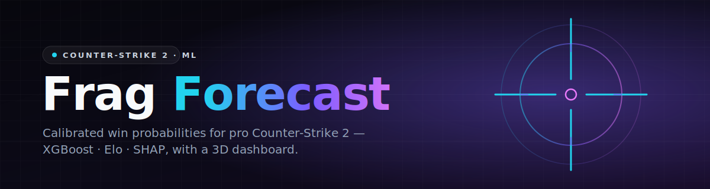
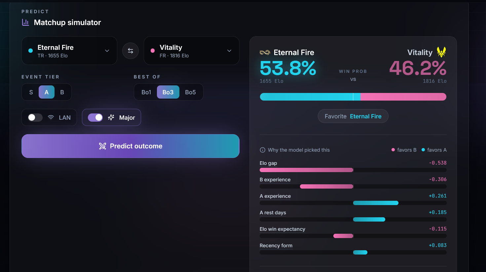
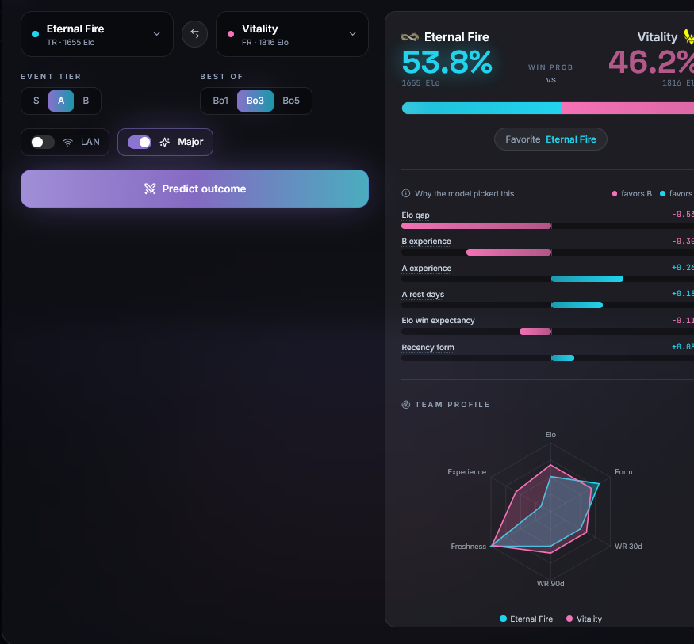
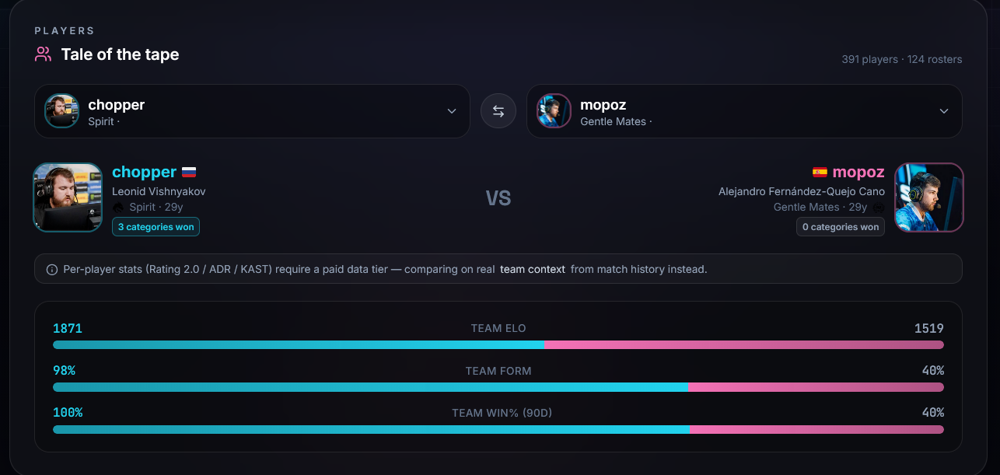
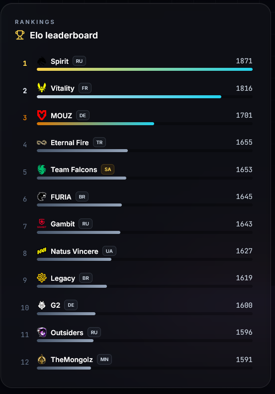
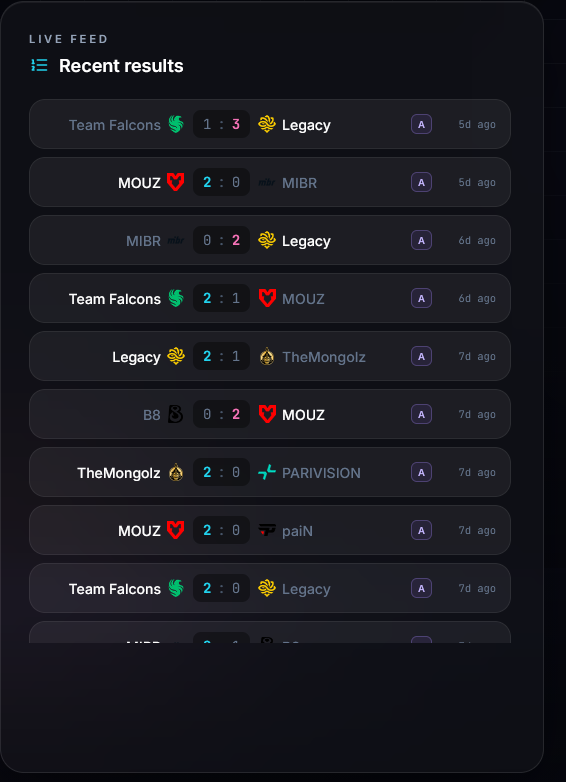
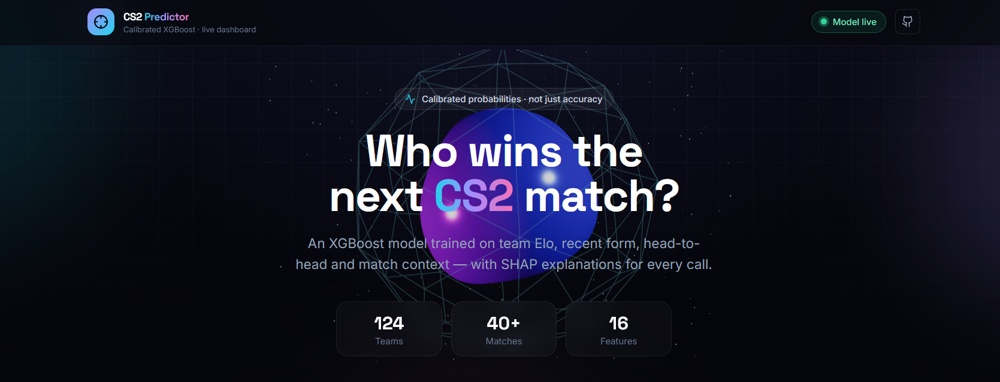
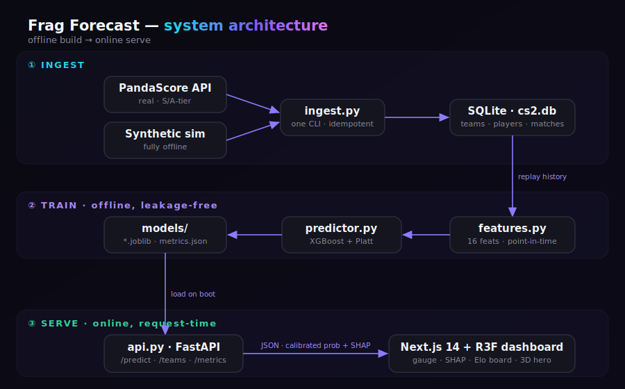

<div align="center">



### _Calibrated win probabilities for professional Counter-Strike 2 — with a 3D dashboard that has no business being this nice._

<br/>


-7c5cff)


**Scrape → engineer → calibrate → serve → visualize → explain.**
Real teams. Real players. Real photos. Real matches. Honest metrics.

[**Quickstart**](#-quickstart) · [**API**](#-api-reference) · [**Why it's portfolio-worthy**](#-what-makes-it-portfolio-worthy) · [**Caveats**](#️-honest-caveats)

</div>

---

## 📸 Demo

<div align="center">

**The matchup simulator** — searchable team pickers, live context toggles, an animated
split probability gauge, and a per-prediction SHAP breakdown of *why* the model leans the way it does.



</div>

|                                         |                                         |
| :-------------------------------------: | :-------------------------------------: |
|  |  |
| **Team-profile radar** — Elo, form, freshness, win-rate, experience at a glance | **Player "tale of the tape"** — real photos, flags, and a head-to-head on real team context |
|  |  |
| **Elo leaderboard** — every team ranked, with logos and region tags | **Live results feed** — recent matches with scores, tiers, and recency |

<details>
<summary>🎬 The landing hero</summary>



</details>

---

## 🧭 Contents

- [⚡ TL;DR](#-tldr) — what this is, in one diagram
- [🧠 The headline number](#-the-headline-number-kept-honest) — model vs. the Elo baseline
- [✨ Features](#-features) — the brains 🧮 and the looks 🎨
- [🏗️ Architecture](#️-architecture--repo-layout) — repo layout
- [🚀 Quickstart](#-quickstart) — running locally in four steps
- [🔌 API reference](#-api-reference) — endpoints + a `/predict` example
- [🛠️ Tech stack](#️-tech-stack)
- [🔬 Why it's portfolio-worthy](#-what-makes-it-portfolio-worthy)
- [⚠️ Honest caveats](#️-honest-caveats) · [🗺️ Roadmap](#️-roadmap) · [📄 License](#-license)

---

## ⚡ TL;DR

> Most "ML portfolio projects" stop at a notebook printing `accuracy_score`.
> This one ships the **whole pipeline** — real data ingestion, leakage-free feature
> engineering, a **calibrated** model whose probabilities you can actually trust,
> a typed FastAPI service, **SHAP** explanations for every prediction, and a
> **Next.js + Three.js** dashboard with an animated 3D hero, a tug-of-war player
> comparison with real photos, an Elo leaderboard, and a live reliability diagram.

<div align="center">



</div>

<details>
<summary>Text version</summary>

```text
  ───────────────────────────  ①  INGEST  ───────────────────────────

     PandaScore API (real S/A-tier)  ┐
                                     ├──▶  ingest.py  ──▶  SQLite · cs2.db
     synthetic simulator (offline)   ┘    · one CLI, idempotent upserts
                                          · teams · players (+photos) · matches

  ───────────────────────────  ②  TRAIN  ────────────────────────────
                                                       (offline · leakage-free)
     cs2.db  ──▶  features.py  ──▶  predictor.py  ──▶  models/
                  · 16 features, strictly point-in-time (no leakage)
                  · XGBoost + Platt scaling → calibrated probabilities
                  · time-split eval vs Elo → metrics.json · reliability.png

  ───────────────────────────  ③  SERVE  ────────────────────────────
                                                       (online · request-time)
     models/ + cs2.db  ──▶  api.py (FastAPI)  ──JSON──▶  Next.js 14 + R3F
                            · /predict → calibrated prob + SHAP        dashboard
                            · /teams /players /matches /metrics
                            · gauge · SHAP · Elo board · reliability · 3D hero 🪄
```

</details>

---

## 🧠 The headline number (kept honest)

Trained and evaluated on **1,600 real top-tier matches** (2021–2026), with a strict
**time-based** split (no peeking at the future). The model is compared head-to-head
against a pure-Elo baseline on the untouched test tail:

| Metric        | Elo baseline | **XGBoost (calibrated)** |     Verdict      |
| ------------- | :----------: | :----------------------: | :--------------: |
| Accuracy      |    0.654     |        **0.654**         |       tied       |
| ROC AUC       |    0.710     |        **0.712**         | 🟢 model edges it |
| Log-loss      |  **0.624**   |          0.638           |  Elo a hair ahead |
| Brier         |  **0.217**   |          0.223           |  Elo a hair ahead |

> **Why we brag about this _and_ admit it:** beating Elo at match prediction is
> genuinely hard — it's a brutally strong baseline. After adding a **map-margin
> form** feature (quality of wins, not just win/loss), the model **caught Elo on
> accuracy and nudged past it on AUC**, while staying well-calibrated. The
> dashboard ships the **reliability diagram** so you can verify the probabilities
> aren't lying. No cherry-picking, no random split inflation.

---

## ✨ Features

### The brains 🧮
- **Real data ingestion** from [PandaScore](https://pandascore.co) — recent **S/A-tier**
  tournaments → their teams → full rosters (with official photos) → match results.
  Idempotent upserts keyed by provider IDs.
- **Synthetic generator** — a latent-skill simulation so the _entire pipeline runs
  offline with zero network access_. Clone → seed → train → done.
- **In-house Elo** (per-event K-factors for online / LAN / Major).
- **16 leakage-free features**, every one computable strictly _before_ the match:
  Elo gap & expectancy · win-rate over 10/30/90d · recency-weighted form ·
  **map-margin form** · head-to-head · rest days · experience · tier · LAN · Major · best-of.
- **Calibrated XGBoost** — gradient boosting wrapped in **Platt scaling** on a held-out
  slice, because a model that says "77%" should be right 77% of the time.
- **SHAP** attributions for _every single prediction_.

### The looks 🎨
- **3D animated hero** — a morphing, metallic core orb caged in a wireframe icosahedron,
  drifting through a starfield, parallaxing toward your cursor (React Three Fiber + drei).
- **Matchup simulator** — searchable team pickers (with logos), context toggles
  (tier / Bo / LAN / Major), an animated split **probability gauge**, a **SHAP** breakdown,
  and a **team-profile radar** — all wired to the live model.
- **Player "Tale of the Tape"** — pick two players, see **real photos**, flags, roles, ages,
  and a tug-of-war stat comparison.
- **Elo leaderboard** + **live results feed** with real team logos.
- **Model performance** panel — reliability diagram + metric cards vs the Elo baseline.
- **Polish layer** — Framer Motion everywhere, Lenis smooth scroll, confetti on a strong
  favorite, toasts, Radix tooltips, and a full `prefers-reduced-motion` escape hatch.

---

## 🏗️ Architecture & repo layout

```
esports-predictor/
├── backend/
│   ├── api.py            # FastAPI: /predict /teams /players /matches /metrics …
│   ├── pandascore.py     # Real CS2 data client (auth, pagination, backoff)
│   ├── ingest.py         # PandaScore + synthetic seeder + HLTV scraper (CLI)
│   ├── features.py       # Point-in-time, leakage-free feature engineering
│   ├── elo.py            # Pure Elo rating system (unit-testable)
│   ├── predictor.py      # XGBoost + calibration + SHAP, save/load
│   ├── train.py          # Time-split training, metrics, reliability diagram
│   ├── db.py             # SQLAlchemy models (Team / Player / Match)
│   └── requirements.txt
├── frontend/             # Next.js 14 (App Router) + TS + Tailwind + R3F
│   ├── app/              # layout, page, global styles
│   ├── components/       # three/ · charts/ · players/ · predict/ · ui/
│   └── lib/              # typed API client, types, utils, confetti
├── .env.example
└── README.md             # you are here 👋
```

---

## 🚀 Quickstart

### 0. Prereqs
Python **3.12+**, Node **18+**, and (optionally) a free **PandaScore** token for real data.

### 1. Backend

```bash
cd backend
python -m venv .venv
.venv\Scripts\activate            # Windows  (use: source .venv/bin/activate on macOS/Linux)
pip install -r requirements.txt
copy ..\.env.example ..\.env      # then edit .env
```

### 2. Get data — pick your reality

**🟣 Real data (PandaScore):** grab a free token at <https://pandascore.co>, put it in
`backend/.env` as `PANDASCORE_TOKEN=...`, then:

```bash
python ingest.py pandascore --fresh --tier s,a --pages 4   # real top-tier teams/players/matches
```

**🟢 Synthetic data (no account, fully offline):**

```bash
python ingest.py seed --teams 40 --matches 4000 --days 365 --reset
```

### 3. Train + serve

```bash
python train.py                          # time-split, calibrate, write metrics + reliability.png
uvicorn api:app --reload --port 8000     # API on :8000
```

### 4. Frontend

```bash
cd frontend
npm install
npm run dev                              # http://localhost:3000
```

> The dashboard defaults to the API at `http://localhost:8000`. To point it elsewhere,
> set `NEXT_PUBLIC_API_URL` in `frontend/.env.local`.

Open **http://localhost:3000** and start predicting. 🎉 If the API isn't up yet, the page
shows a friendly "Can't reach the API" panel with the exact command to start it.

---

## 🔌 API reference

| Method | Endpoint                  | Returns                                                   |
| ------ | ------------------------- | --------------------------------------------------------- |
| `GET`  | `/health`                 | service status, model & history loaded flags              |
| `GET`  | `/teams`                  | all teams w/ Elo, region, **logo**                        |
| `GET`  | `/teams/{name}/players`   | a team's roster (photos, role, nationality, age)          |
| `GET`  | `/teams/{name}/stats`     | rolling team profile (Elo, form, win-rate, rest)          |
| `GET`  | `/players`                | all players w/ team + **photo**                           |
| `GET`  | `/matches?limit=N`        | recent results                                            |
| `GET`  | `/metrics`                | model vs baseline metrics + reliability curve             |
| `POST` | `/predict`                | calibrated win probs + favorite + **SHAP** explanation    |

<details>
<summary><code>POST /predict</code> — example</summary>

```bash
curl -X POST http://localhost:8000/predict -H "Content-Type: application/json" -d '{
  "team_a": "Spirit", "team_b": "Vitality",
  "event_tier": "S", "is_lan": true, "best_of": 3
}'
```
```jsonc
{
  "team_a": "Spirit", "team_b": "Vitality",
  "prob_a": 0.6314, "prob_b": 0.3686,
  "favorite": "Spirit",
  "elo_a": 1871.0, "elo_b": 1816.0,
  "explanation": [
    { "feature": "winrate_90d_diff", "value": 0.18, "shap": -0.296 },
    { "feature": "elo_diff",         "value": 55.0, "shap":  0.282 }
    // …top contributions, largest magnitude first
  ]
}
```
</details>

---

## 🛠️ Tech stack

**Backend** · FastAPI · Uvicorn · Pydantic · SQLAlchemy 2 · pandas · NumPy ·
scikit-learn · XGBoost · SHAP · httpx · tenacity

**Frontend** · Next.js 14 (App Router) · TypeScript · Tailwind CSS ·
Framer Motion · **React Three Fiber + drei + three** · Recharts ·
canvas-confetti · sonner · Lenis · Radix UI · lucide-react

**Data** · PandaScore API (real) · synthetic simulator (offline) · SQLite (Postgres-ready)

---

## 🔬 What makes it portfolio-worthy

1. **Calibration, not just accuracy** — Platt-scaled probabilities + a reliability diagram you can audit.
2. **No leakage, ever** — strictly time-ordered replay; features only see the past; chronological splits.
3. **A real baseline to beat** — every metric is reported _next to Elo_, the gold standard.
4. **Explainability** — SHAP attributions on every prediction, surfaced in the UI.
5. **Honesty as a feature** — where the free data tier lacks per-player stats, the UI says so
   instead of fabricating numbers. Where Elo wins, we admit it.
6. **It actually ships** — typed end-to-end, builds clean, runs end-to-end.

---

## ⚠️ Honest caveats

- **Per-player stats** (Rating 2.0 / ADR / KAST) require a **paid** PandaScore tier — the free
  tier returns `403`. So the player comparison uses **real identities + photos** and compares
  on **real team context** (Elo / form / win-rate), with a note in the UI. The ingest code already
  tries to populate per-player stats (`--with-stats`) the moment a capable tier is connected.
- **Synthetic mode** is clearly simulated data for offline demos — it is not real results.
- Scraping HLTV directly is **not** used: it's Cloudflare-protected, against their ToS, and the
  photos are copyrighted. PandaScore is the licensed, legitimate source.

---

## 🗺️ Roadmap

- [x] Real data ingestion (PandaScore) + synthetic fallback
- [x] Calibrated XGBoost + SHAP + reliability diagram
- [x] FastAPI service + Next.js/Three.js dashboard
- [x] Player comparison with real photos
- [x] Map-margin feature → match/beat Elo on AUC
- [ ] Beat Elo on **log-loss** (opponent-adjusted form, Elo+model ensemble)
- [ ] Backtest vs bookmaker odds (simulated ROI)
- [ ] Per-team pages + roster galleries
- [ ] Deploy (API + dashboard)

---

## 📄 License

MIT — do whatever, just don't claim the synthetic stats are real. 😉

<div align="center">

_Built with calibrated probabilities and an unreasonable number of animations._

</div>
